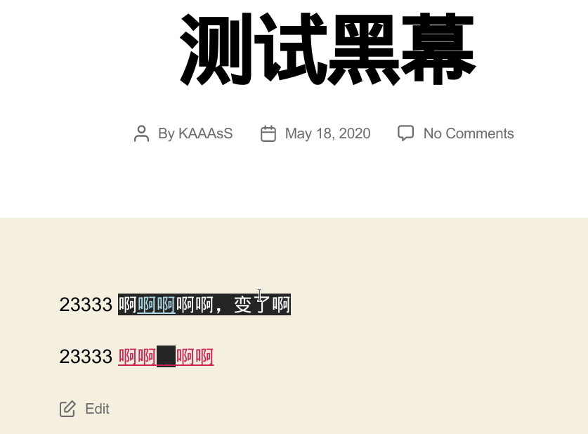
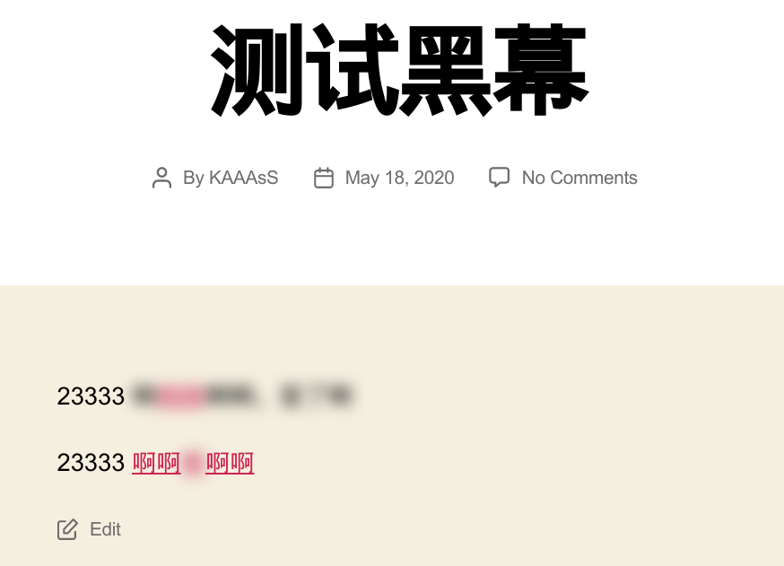

# WordPress Heimu Plugin

A 黑幕(black curtain) plugin for WordPress

# Installation

It is recommend to install with WordPress Plugin: https://wordpress.org/plugins/heimu/

Or, you could download from Release page.

# Syntax

`[hm]Things you want to "heimu"[/hm]`

Shortcode can be changed in plugin settings.

# Screenshot

# Todo

- [ ] Support i18n
- [x] Support blur effect